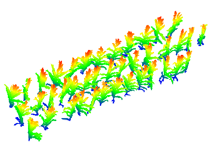
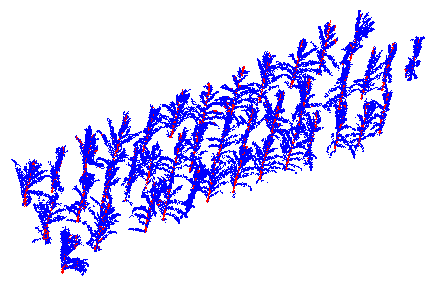
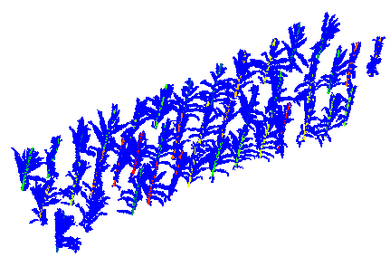
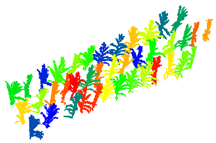

# Corn_segmentation

Citation:
--------
Zurui Ao, Fangfang Wu, Saihan Hu, Ying Sun, Yanjun Su, Qinghua Guo, Qinchuan Xin,
Automatic segmentation of stem and leaf components and individual maize plants in field terrestrial LiDAR data using convolutional neural networks,
The Crop Journal,
2021.


Compile:
--------

1. Compile the tf_sampling module of pointCNN following the guidelines in https://github.com/yangyanli/PointCNN
2. Unzip the pretrained pointCNN model in folder /pointCNN/save
3. Compile the c++ code in folders /cornExtract and /stemExtract, expectively. Note that PCL c++ library is required, which can be installed via https://pointclouds.org/downloads/. For windows users, we have provided executable files in the folder /data/cornExtract.exe and /data/stemExtract.exe. 

Reproduce the results:
--------

1. All data and codes are listed in the folder /data. "testdata_original.txt" is the test data in the form of XYZ, it's shown as below (colored by height):  

  

2. Because the PointCNN only supports a specific number of points (2048) as input, we divide the testdata into grids, and normalize the points in each grid by running the following matlab code:  
    ```
    proc_1_normalizeTestdata.m
    ```  
    Then we get 3 files, where the "testdata_nor.txt" is the normalized point cloud data, params.mat is the normalizing paramaters, and if a grid does not contain enough points, the points are recorded in the remain.mat  
    
3. Run the pointCNN code to downsample and classify the point cloud:  
     ```
    cd /pointCNN
    python test_seg.py --load_ckpt save/epoch_final.ckpt
    ```  
    The classification results are stored in the file "pointcnn_test.mat". Since the points are shuffled, we need to run the following Matlab code to reconstruct the point cloud:  
    ```
    proc_3_reconstruct.m
    ```  
    Then we get a point cloud stored in "pointcnn_test.txt". There are 4 columns in this file, which represent X,Y,Z, label(0 leaf and 1 stem), it's shown as below (colored by label):  

  

4. PointCNN has downsampled the point cloud, and the intial classification results contains lots of errors. Run the stemExtract.exe to refine the classification results using RANSAC method:  
    ```
    stemExtract testdata_original.txt pointcnn_test.txt 0.04
    ```  
    stemExtract requires 3 parameters, The first parameter is the original point cloud that has not been downsampled. The second parameter is the downsampled and labeled point cloud produced py PointCNN. The last parameter is the radius of stem.  
    
    Two files are obtained. "pointcnn_test_refined.txt" is the refined result, which is in the form of X,Y,Z, label(0 leaf and 1~40 stems); "pointcnn_test_stem_coeffs.txt" records the parameter of the fitted line for each stem, which is in the form of X_center, Y_center,Z_center, X_direction, Y_direction, Z_direction  
    
    The refined stem segmentation results are shown as below (colored by label):  

  
    
5. At this point we have obtained the stem instances and unsegmented leaves. Run the cornExtract.ext to segment the point cloud into individual maize plants：  
    ```
    cornExtract pointcnn_test_refined.txt 0.03 10
    ```  
    cornExtract requires 3 parameters, The first parameter is the stem segment result we just obtained. The second parameter is the search radius R_nghbr of the DBSCAN method. The last parameter is the percentile of number of neighbors for all points,which is used for core point identification in the DBSCAN method.  
    
    Then we get a point cloud stored in "pointcnn_test_refined_cluster.txt". There are 7 columns in this file, which represent X,Y,Z,R,G,B, label(1~40 for each individual maize plant)  
    
    The segmented individual maize plants are shown as below (colored by label):  

  
